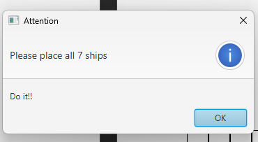

# Battle-ship
- Các thư viện dùng trong project (có thể xem trong file [pom.xml](./MiniBattleship/pom.xml))
    - [JavaFX 19](https://gluonhq.com/products/javafx/)
    - [Jsoup 1.15.3](https://mvnrepository.com/artifact/org.jsoup/jsoup)
    - [org.json 20220924](https://mvnrepository.com/artifact/org.json/json)
## Một số giao diện
- Giao diện bắt đầu:

    
- Giao diện đặt tàu:

    
- Giao diện chơi game:

    
### Một số giao diện báo lỗi:
- Lỗi không điền tên

    
- Lỗi không đặt đủ thuyền:
    
    
- Lỗi đặt thuyền:

    
- Lỗi đặt quá số lượng thuyền quy định:

    
- Lỗi bắn thuyền:

    
